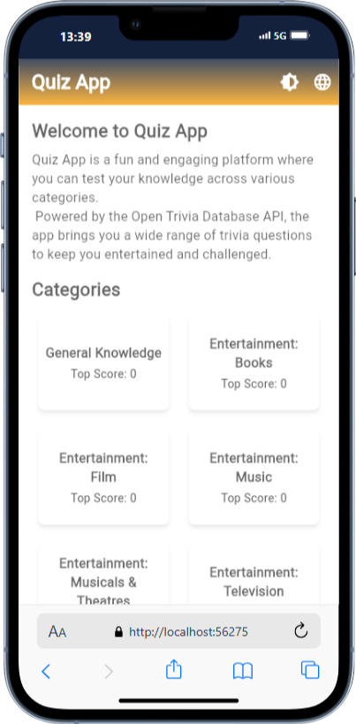
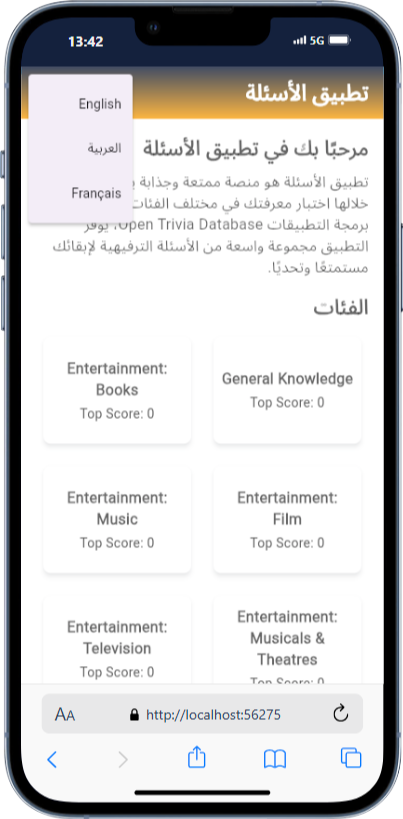
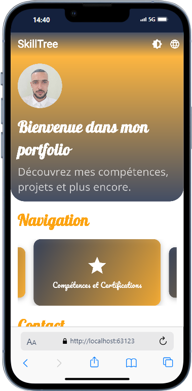
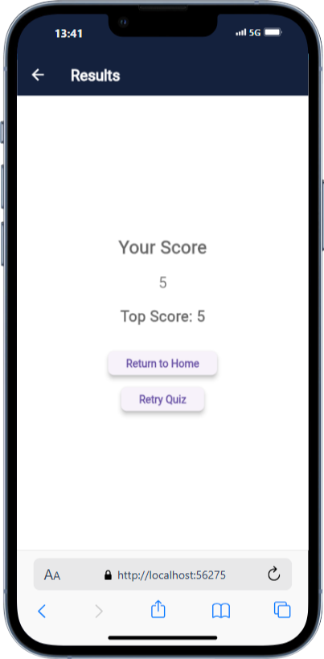

# Quiz App Portfolio Project

Welcome to my **Quiz App Portfolio Project**! This repository showcases a simple, interactive quiz app built using **Flutter**. Dive into the code, explore the features, and see how the app works.

---

## Table of Contents

- [Quiz App Portfolio Project](#quiz-app-portfolio-project)
  - [Table of Contents](#table-of-contents)
  - [Features](#features)
  - [Screenshots](#screenshots)
    - [Home Screen](#home-screen)
    - [Quiz Page](#quiz-page)
    - [Results Page](#results-page)
  - [Getting Started](#getting-started)
    - [Prerequisites](#prerequisites)

---

## Features

The **Quiz App** comes with these exciting features:

- **Modern UI**: Sleek, user-friendly, and visually appealing design.
- **Cross-Platform**: Fully functional on both **Android** and **iOS**.
- **Interactive Quiz Experience**: Multiple-choice questions with instant feedback.
- **Timer Integration**: Countdown timer to make the quiz experience more interactive.
- **API Integration**: Questions dynamically fetched from [Open Trivia Database](https://opentdb.com).
- **Smooth Navigation**: Intuitive navigation between different app sections like the home screen, quiz screen, and results screen.
- **State Management with Provider**: Efficient management of quiz state and logic.

---

## Screenshots

### Home Screen
The entry point of the app, showing quiz categories and information about the quiz's features.

### Quiz Page
This is where users answer the questions under time pressure.

### Results Page
Users can view their scores and the top score for each quiz category.

---

## Getting Started

To get a local copy of the app up and running on your machine, follow these steps.

---

### Prerequisites

Ensure you have the following tools installed:

- **Flutter SDK**: [Setup Instructions](https://flutter.dev/docs/get-started/install)
- **Android Studio** or **Xcode** (for iOS development):  
  - [Android Studio](https://developer.android.com/studio)  
  - [Xcode](https://developer.apple.com/xcode/)

---

